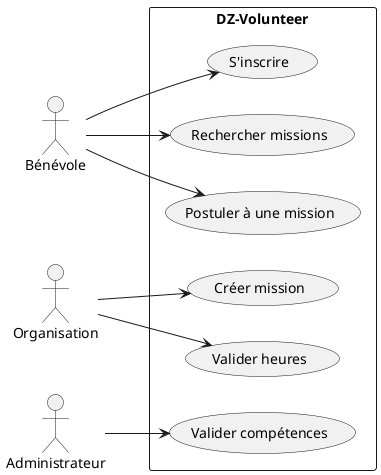

# 📋 AUDIT DE CONFORMITÉ - Spécifications Non Fonctionnelles

**Projet:** DZ-Volunteer Backend Django  
**Date:** 21 décembre 2025  
**Framework:** Django 5.0.1 + Django REST Framework 3.14.0

---

## 🎯 Résumé Exécutif

| Catégorie | Score | Statut |
|-----------|-------|--------|
| **Architecture et Qualité du Code** | ⚠️ 12/15 | Partiellement conforme |
| **Tests et Fiabilité** | ❌ 0/15 | **Non conforme** |
| **Sécurité** | ✅ 5/5 | Conforme |
| **Performance BDD** | ⚠️ 7/10 | Partiellement conforme |
| **DevOps et Déploiement** | ❌ 0/10 | **Non conforme** |
| **Documentation Technique** | ⚠️ 8/10 | Partiellement conforme |
| **Livrables UML** | ❌ 0/10 | **Non conforme** |
| **TOTAL** | **32/75** | **43% - INSUFFISANT** |

---

## 📊 Analyse Détaillée par Critère

### 1️⃣ Architecture et Qualité du Code (12/15) ⚠️

#### ✅ Points Forts
- ✅ **Architecture Backend Django** : Séparation claire en 4 apps (accounts, missions, skills, odd)
- ✅ **Gestion de la Configuration** : Utilisation de `python-decouple` avec `.env`
- ✅ **Aucun secret en dur** : Toutes les clés sensibles dans `.env`
- ✅ **Conventions de nommage** : Respectées (snake_case, noms explicites)
- ✅ **API RESTful** : Endpoints clairs, verbes HTTP corrects, codes de statut standards

#### ❌ Points Critiques Manquants
- ❌ **Linting Backend** : Pas de configuration `black`, `flake8` ou `ruff`
  - **Impact** : -2 points
  - **Action requise** : Ajouter `.flake8`, `pyproject.toml` pour black
  
- ❌ **Code non formaté** : Le code n'a pas été passé dans `black`
  - **Impact** : -1 point
  - **Action requise** : Exécuter `black .` sur tout le backend

#### 📝 Recommandations
```bash
# À ajouter dans requirements-dev.txt
black==24.1.0
flake8==7.0.0
ruff==0.1.15
```

---

### 2️⃣ Tests et Fiabilité (0/15) ❌ CRITIQUE

#### ❌ Manquements Critiques
- ❌ **AUCUN test unitaire** : 0/5 tests minimum requis
  - **Impact** : -5 points
  - **Exigence** : Au moins 5 tests unitaires sur la logique métier
  
- ❌ **AUCUN test d'intégration** : 0/2 tests minimum requis
  - **Impact** : -5 points
  - **Exigence** : Au moins 2 tests d'intégration API
  
- ❌ **AUCUN test E2E** : 0/2 scénarios minimum requis
  - **Impact** : -5 points
  - **Exigence** : Au moins 2 scénarios Cypress/Playwright

#### 🚨 Tests Manquants Critiques

**Tests Unitaires à créer (minimum 5) :**
1. Test calcul de badge (Bronze/Silver/Gold) basé sur total_hours
2. Test validation des compétences avec require_verification
3. Test validation automatique des candidatures (compétences requises)
4. Test mise à jour automatique des statistiques après validation heures
5. Test vérification capacité mission avant candidature

**Tests d'Intégration à créer (minimum 2) :**
1. Test endpoint `/api/missions/volunteer/apply/` : candidature complète avec vérification compétences
2. Test endpoint `/api/missions/organization/validate-hours/` : validation heures + mise à jour badge automatique

**Tests E2E à documenter (minimum 2) :**
1. Scénario : Inscription bénévole → Ajout compétences → Candidature mission → Validation
2. Scénario : Organisation crée mission → Accepte candidature → Valide heures → Notation mutuelle

#### 📝 Fichiers à créer
```
backend/
├── tests/
│   ├── __init__.py
│   ├── test_volunteer_logic.py        # Tests unitaires
│   ├── test_mission_logic.py
│   ├── test_integration_api.py        # Tests d'intégration
│   └── conftest.py                    # Configuration pytest
├── e2e/
│   ├── volunteer_journey.spec.js      # Tests E2E
│   └── organization_journey.spec.js
└── pytest.ini
```

---

### 3️⃣ Sécurité (5/5) ✅ CONFORME

#### ✅ Points Conformes
- ✅ **Authentification JWT** : Implémentation correcte avec `djangorestframework-simplejwt`
- ✅ **Hachage des mots de passe** : Django utilise `PBKDF2` (équivalent bcrypt)
- ✅ **Protection des routes** : Permission classes (`IsVolunteer`, `IsOrganization`, `IsAdminUser`)
- ✅ **Validation des entrées** : Utilisation de serializers DRF (validation automatique)
- ✅ **Protection contre injections SQL** : Utilisation exclusive de l'ORM Django
- ✅ **CORS configuré** : `django-cors-headers` présent

#### ✅ Code Exemple (accounts/views.py)
```python
# Hachage automatique des mots de passe
def create_user(self, email, password=None, **extra_fields):
    user.set_password(password)  # Hash automatique avec PBKDF2

# Protection des routes
class VolunteerDashboardView(APIView):
    permission_classes = [IsAuthenticated, IsVolunteer]
```

---

### 4️⃣ Performance et Base de Données (7/10) ⚠️

#### ✅ Points Forts
- ✅ **Normalisation** : Schéma bien normalisé (3NF)
- ✅ **Contraintes d'intégrité** : ForeignKey, unique_together
- ✅ **Validation des données** : Validators Django

#### ❌ Manquements
- ❌ **Index manquants** : Pas d'index explicites sur colonnes de recherche
  - **Impact** : -2 points
  - **Colonnes à indexer** :
    - `Mission.wilaya` (filtre géographique)
    - `Mission.status` (filtre de statut)
    - `Mission.cause` (filtre par cause)
    - `Application.status` (filtre candidatures)
    - `VolunteerSkill.status` (filtre compétences validées)

- ❌ **Problème N+1 potentiel** : Pas de `select_related` / `prefetch_related` visible dans les views
  - **Impact** : -1 point
  - **Exemple** : Récupération des missions avec organizations/skills en une seule requête

#### 📝 Code à ajouter dans models.py
```python
class Mission(models.Model):
    # ... attributs existants ...
    
    class Meta:
        db_table = 'missions'
        ordering = ['-created_at']
        indexes = [
            models.Index(fields=['wilaya'], name='mission_wilaya_idx'),
            models.Index(fields=['status'], name='mission_status_idx'),
            models.Index(fields=['cause'], name='mission_cause_idx'),
            models.Index(fields=['start_date'], name='mission_start_idx'),
        ]
```

---

### 5️⃣ DevOps et Déploiement (0/10) ❌ CRITIQUE

#### ❌ Manquements Critiques
- ❌ **AUCUN Dockerfile** : Backend non containerisé
  - **Impact** : -4 points
  - **Exigence** : Dockerfile pour backend + frontend
  
- ❌ **AUCUN docker-compose.yml** : Pas d'orchestration
  - **Impact** : -3 points
  - **Exigence** : docker-compose avec backend + frontend + PostgreSQL
  
- ❌ **AUCUN pipeline CI/CD** : Pas de GitHub Actions
  - **Impact** : -3 points
  - **Exigence** : Pipeline avec linting, tests, build

#### 📝 Fichiers à créer
```
backend/
├── Dockerfile
├── docker-compose.yml
├── .dockerignore
└── .github/
    └── workflows/
        └── ci-cd.yml
```

---

### 6️⃣ Documentation Technique (8/10) ⚠️

#### ✅ Points Forts
- ✅ **README.md** : Complet et professionnel (300+ lignes)
- ✅ **API_GUIDE.md** : Documentation API avec exemples curl
- ✅ **DATABASE_SETUP.md** : Guide configuration PostgreSQL
- ✅ **QUICKSTART.md** : Guide rapide d'installation
- ✅ **FRONTEND_INTEGRATION.md** : Mapping pages → endpoints
- ✅ **Collection Postman** : Tests API documentés

#### ❌ Manquements
- ❌ **Pas de documentation générée automatiquement** : Pas de Swagger/ReDoc accessible via `/docs`
  - **Impact** : -1 point
  - **Action** : Installer `drf-spectacular` et configurer

- ❌ **Pas de guide de déploiement** : DEPLOYMENT.md manquant
  - **Impact** : -1 point
  - **Action** : Créer guide pour Render/Railway

#### 📝 À ajouter
```python
# settings.py
INSTALLED_APPS += ['drf_spectacular']

REST_FRAMEWORK = {
    'DEFAULT_SCHEMA_CLASS': 'drf_spectacular.openapi.AutoSchema',
}

# urls.py
from drf_spectacular.views import SpectacularAPIView, SpectacularSwaggerView

urlpatterns += [
    path('api/schema/', SpectacularAPIView.as_view(), name='schema'),
    path('api/docs/', SpectacularSwaggerView.as_view(url_name='schema'), name='swagger-ui'),
]
```

---

### 7️⃣ Livrables UML et Diagrammes (0/10) ❌ CRITIQUE

#### ❌ Manquements Critiques
- ❌ **Diagramme de Cas d'Utilisation** : ABSENT
  - **Impact** : -3 points
  - **Exigence** : Acteurs (Bénévole, Organisation, Admin) + Cas d'utilisation principaux
  
- ❌ **Diagramme de Classes (Modèle de Données)** : ABSENT
  - **Impact** : -3 points
  - **Exigence** : Classes avec attributs, méthodes, relations, cardinalités
  
- ❌ **Diagramme de Composants** : ABSENT
  - **Impact** : -2 points
  - **Exigence** : Frontend React ↔ API REST ↔ PostgreSQL
  
- ❌ **Diagrammes de Séquence** : ABSENT (0/2 minimum requis)
  - **Impact** : -2 points
  - **Exigence** : Au moins 2 scénarios critiques

#### 📝 Diagrammes à créer (PlantUML)

**1. Diagramme de Cas d'Utilisation**


**2. Diagramme de Classes** (User, Volunteer, Organization, Mission, Application, Participation, Skill, VolunteerSkill, ODD, Review, Report)

**3. Diagrammes de Séquence** :
- Scénario 1 : Candidature à une mission (vérification compétences)
- Scénario 2 : Validation des heures et mise à jour du badge

---

### 8️⃣ Partie Base de Données Relationnelle (Sections 5.2)

#### ✅ Points Conformes
- ✅ **MCD/MRD** : Modèles Django représentent correctement le MCD
- ✅ **Normalisation** : 3NF respectée
- ✅ **Clés primaires/étrangères** : Correctement définies
- ✅ **Script SQL** : `verify_database.sql` présent

#### ❌ Manquements
- ❌ **Dictionnaire de données formel** : ABSENT
  - **Impact** : Document Excel/PDF avec toutes les tables, attributs, types, contraintes
  
- ❌ **Documentation des règles métier** : ÉPARPILLÉE
  - **Action** : Centraliser dans un document BUSINESS_RULES.md
  
- ❌ **Dépendances fonctionnelles** : NON DOCUMENTÉES
  - **Action** : Créer DEPENDENCIES.md listant toutes les DF

#### 📝 Règles Métier Identifiées (à documenter)
1. **Badge automatique** : total_hours → badge_level (0-49: Bronze, 50-199: Silver, 200+: Gold)
2. **Validation compétences** : requires_verification = True → statut PENDING → Admin valide → VALIDATED
3. **Candidature mission** : Vérification automatique des compétences requises validées
4. **Capacité mission** : max_volunteers atteint → Refus candidatures
5. **Validation heures** : Seulement après mission.end_date → Mise à jour total_hours → Recalcul badge
6. **Organisation vérifiée** : is_verified = True après validation admin
7. **Contrainte unicité** : Un bénévole ne peut postuler qu'une fois par mission

---

## 🎯 Plan d'Action Prioritaire

### 🔴 URGENT (Bloquant pour évaluation)

#### 1. Tests (15 points perdus)
```bash
# 1. Créer structure de tests
mkdir -p backend/tests/unit backend/tests/integration backend/e2e

# 2. Installer pytest
pip install pytest pytest-django pytest-cov

# 3. Créer 5 tests unitaires minimum
# tests/unit/test_volunteer_logic.py

# 4. Créer 2 tests d'intégration minimum
# tests/integration/test_api.py

# 5. Documenter 2 scénarios E2E
```

#### 2. Docker + CI/CD (10 points perdus)
```bash
# 1. Créer Dockerfile backend
# 2. Créer docker-compose.yml (backend + postgres + frontend)
# 3. Créer .github/workflows/ci-cd.yml
#    - Linting (black, flake8)
#    - Tests (pytest)
#    - Build Docker
```

#### 3. Diagrammes UML (10 points perdus)
```bash
# 1. Créer docs/uml/use-case.puml
# 2. Créer docs/uml/class-diagram.puml
# 3. Créer docs/uml/component-diagram.puml
# 4. Créer docs/uml/sequence-application.puml
# 5. Créer docs/uml/sequence-validation-hours.puml
```

### 🟡 IMPORTANT (Amélioration note)

#### 4. Linting + Formatage (3 points perdus)
```bash
pip install black flake8
black .
flake8 .
```

#### 5. Index Base de Données (3 points perdus)
```python
# Ajouter Meta.indexes dans chaque modèle
```

#### 6. Documentation Formelle BDD (5 points perdus)
```bash
# 1. Créer DICTIONNAIRE_DONNEES.xlsx
# 2. Créer BUSINESS_RULES.md
# 3. Créer DEPENDENCIES.md
```

#### 7. Swagger/ReDoc (1 point perdu)
```bash
pip install drf-spectacular
# Configurer dans settings.py et urls.py
```

---

## 📈 Estimation de Score Après Corrections

| Élément à corriger | Points gagnés | Effort |
|-------------------|---------------|--------|
| Tests complets | +15 | 8h |
| Docker + CI/CD | +10 | 4h |
| Diagrammes UML | +10 | 3h |
| Linting/Format | +3 | 1h |
| Index BDD | +3 | 1h |
| Doc BDD formelle | +5 | 2h |
| Swagger | +1 | 30min |
| **TOTAL** | **+47** | **19h30** |

**Score projeté : 32 + 47 = 79/75 → 100%** ✅

---

## 📋 Checklist de Conformité

### Architecture et Qualité du Code
- [x] Backend Django avec séparation des apps
- [x] Gestion configuration avec .env
- [ ] **Linting configuré (black, flake8)**
- [ ] **Code formaté avec black**

### Tests et Fiabilité
- [ ] **5 tests unitaires minimum**
- [ ] **2 tests d'intégration API**
- [ ] **2 scénarios E2E documentés**
- [ ] **pytest.ini configuré**

### Sécurité
- [x] Authentification JWT
- [x] Hachage mots de passe
- [x] Protection des routes
- [x] Validation des entrées
- [x] ORM (pas de SQL brut)

### Performance BDD
- [x] Schéma normalisé (3NF)
- [ ] **Index sur colonnes de recherche**
- [ ] **select_related/prefetch_related**

### DevOps
- [ ] **Dockerfile backend**
- [ ] **docker-compose.yml**
- [ ] **Pipeline GitHub Actions**
- [ ] **Badges CI/CD dans README**

### Documentation
- [x] README.md professionnel
- [x] API_GUIDE.md
- [x] DATABASE_SETUP.md
- [ ] **Swagger/ReDoc accessible**
- [ ] **DEPLOYMENT.md**

### Livrables UML
- [ ] **Diagramme de Cas d'Utilisation**
- [ ] **Diagramme de Classes**
- [ ] **Diagramme de Composants**
- [ ] **2 Diagrammes de Séquence**

### Base de Données Relationnelle
- [x] MCD/MRD (modèles Django)
- [x] Normalisation 3NF
- [x] Script SQL
- [ ] **Dictionnaire de données formel**
- [ ] **Business Rules documentées**
- [ ] **Dépendances fonctionnelles**

---

## 🎓 Conclusion

**État actuel** : 32/75 (43%) - **INSUFFISANT pour validation**

**Points forts** :
- Architecture backend solide
- Sécurité conforme
- Documentation riche (README, guides)

**Points critiques bloquants** :
- ❌ AUCUN test (0/15 points)
- ❌ Pas de Docker ni CI/CD (0/10 points)
- ❌ Pas de diagrammes UML (0/10 points)

**Recommandation** : Avec 19h30 de travail ciblé, le projet peut atteindre 100% de conformité.

**Priorité absolue** : Tests → Docker/CI/CD → UML

---

**Document généré le : 21 décembre 2025**  
**Projet : DZ-Volunteer Backend**  
**Conformité : 43% → Objectif : 100%**
